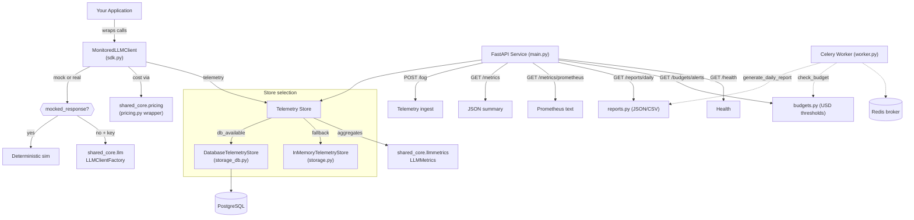

# LLM Cost & Latency Monitor


> An observability layer that wraps LLM API calls to track token usage, estimate cost, measure latency, track prompt versions and errors, generate daily reports, and fire budget alerts — so you can answer "how much did that prompt cost?" before the invoice arrives.

---

## Why This Exists

Production LLM applications are expensive and hard to debug. A single prompt experiment can cost dollars, yet most teams discover their spend only at the end of the billing cycle. Latency varies wildly across models and prompt lengths, errors are transient, and there is no standard way to compare cost-per-quality across providers or prompt versions.

This project is a **lightweight, self-hosted observability layer** that sits between your application and the LLM API. It captures every request, estimates cost in real time, records latency, tracks which prompt version produced it, flags errors, and exposes everything through a FastAPI service — plus a Prometheus endpoint, daily CSV/JSON reports, and budget alerts. Embed it as an SDK wrapper or plug it in as middleware; no external SaaS required.

It is **offline-first**: it boots and runs with **no database and no API keys** (deterministic mock LLM responses, in-memory store). Provide a database and it persists; provide API keys and it calls real providers.

This is a **Wave 1** project in the showcase portfolio. It provides the monitoring infrastructure that downstream AI projects can integrate with to track their own LLM spend.

## What It Demonstrates

- **SDK Wrapper Pattern** — `MonitoredLLMClient` wraps any LLM call, capturing telemetry (cost, latency, tokens, prompt version, errors) without changing the caller's interface. Mock by default; real OpenAI/Anthropic when keyed.
- **Single Source of Truth for Pricing** — cost math is delegated entirely to `shared_core.pricing`; the local `pricing.py` is a thin wrapper over it.
- **Unified Metric Aggregation** — totals, per-model, per-prompt-version, p50/p95/p99 latency and error rate come from `shared_core.llmmetrics.LLMMetrics`, shared by both the in-memory and DB-backed stores.
- **DB Persistence with Graceful Fallback** — telemetry persists to PostgreSQL by default via a `db_available` probe, with a transparent in-memory fallback so tests and demos run with no database.
- **Prometheus + Structured Logging Middleware** — `shared_core.metrics.MetricsMiddleware` and `RequestLoggingMiddleware` instrument every request; a `/metrics/prometheus` endpoint exposes scrapeable metrics.
- **Background Reporting** — a real Celery worker generates daily reports and evaluates budgets, wired to HTTP endpoints and importable without a broker.
- **Budget Alerts** — USD thresholds (total and per-model) produce structured, flagged alerts.

## Architecture



## Tech Stack

| Component | Technology | Justification |
|-----------|-----------|---------------|
| API Framework | FastAPI + Uvicorn | Async-native, automatic OpenAPI docs, middleware support |
| SDK Client | Pure Python | Zero-dependency wrapper, portable across projects |
| Cost Engine | `shared_core.pricing` | Single, override-able source of truth for per-model token pricing |
| Aggregation | `shared_core.llmmetrics` | Shared percentile/error-rate engine used by all stores |
| Persistence | PostgreSQL 16 + SQLAlchemy | Durable telemetry; Alembic-managed schema |
| Metrics | `prometheus_client` | Scrapeable `/metrics/prometheus` endpoint |
| Cache / Broker | Redis 7 | Celery message broker |
| Task Queue | Celery 5.3+ | Async daily reports and budget checks |
| Config | pydantic-settings | Type-safe environment variable loading |
| Logging | Loguru via shared-core | Structured logging + correlation IDs |
| Lint / Format | Ruff | Linting (E, W, F, I, C, B) and formatting |
| Testing | Pytest | FastAPI TestClient + in-memory SQLite |
| Shared Library | `shared-core` v1.3.0 | config, database, redis, logging, errors, metrics, pricing, llmmetrics, llm, tasks, embeddings, testing |

## Local Setup

```bash
cd llm-cost-latency-monitor

# Copy environment template (optional — it runs offline without it)
cp .env.example .env

# Install shared-core (with extras) and the project
make install

# Run the API server (default: http://localhost:8000)
make dev
# OpenAPI docs at http://localhost:8000/docs

# Optional: start PostgreSQL + Redis for persistence and the worker
make docker-up
```

The service runs **with or without** a database. With `make docker-up` (or any reachable `DATABASE_URL`), telemetry persists to PostgreSQL and survives restarts; otherwise it uses the in-memory store.

## Demo

```bash
make demo
```

The demo (`examples/run_demo.py`) simulates a batch of monitored LLM requests across models and prompt versions (no network, no keys), then prints aggregate telemetry, a daily report (JSON + CSV), and a forced budget alert. Two further integration examples are provided:

```bash
make examples   # runs both of the below
python examples/wrapped_fastapi_app.py   # a FastAPI app whose /chat endpoint is monitored
python examples/wrapped_rag_app.py       # a RAG pipeline (offline embeddings) whose generation is monitored
```

## Tests

```bash
make test        # pytest  (91 tests, no network / no DB required)
make lint        # ruff check src/llm_monitor tests examples
make format      # ruff format ...
```

Coverage spans: SDK (mock/real/error paths, prompt versions), pricing delegation to `shared_core`, `LLMMetrics`-backed aggregation, both stores (in-memory + SQLite-backed DB store), the `db_available` probe, daily reports (JSON + CSV), budget alerts, the Celery worker tasks, every API endpoint (success + error), and a smoke test that the demo and both examples run.

## API Reference

| Method | Path | Description |
|--------|------|-------------|
| `POST` | `/log` | Ingest a telemetry record (model, tokens, cost, latency, prompt_version, error) |
| `GET` | `/metrics` | Aggregate JSON summary: totals, per-model, per-prompt-version, p50/p95/p99, error rate |
| `GET` | `/metrics/prometheus` | Prometheus text exposition of HTTP request metrics |
| `GET` | `/reports/daily?day=YYYY-MM-DD&format=json\|csv` | Daily cost/latency report |
| `GET` | `/budgets/alerts?threshold_usd=&per_model_threshold_usd=` | USD budget evaluation with flagged alerts |
| `GET` | `/dashboard?format=json\|text\|html` | Human-readable dashboard view |
| `GET` | `/health` | Service health with database and Redis connectivity |

### Example

```bash
curl -X POST http://localhost:8000/log -H "Content-Type: application/json" -d '{
  "model": "gpt-4o", "prompt_length": 120, "input_tokens": 30,
  "output_tokens": 60, "cost_usd": 0.00105, "latency_ms": 240, "prompt_version": "v2"
}'

curl http://localhost:8000/metrics
curl "http://localhost:8000/reports/daily?format=csv"
curl "http://localhost:8000/budgets/alerts?threshold_usd=1.0"
```

## Configuration

| Variable | Default | Purpose |
|----------|---------|---------|
| `DATABASE_URL` | `postgresql+psycopg://...` | PostgreSQL connection; in-memory fallback if unreachable |
| `REDIS_URL` / `CELERY_BROKER_URL` | `redis://localhost:6379/0` | Redis broker for the Celery worker |
| `BUDGET_THRESHOLD_USD` | `10.0` | Total-spend USD budget for `/budgets/alerts` |
| `BUDGET_PER_MODEL_THRESHOLD_USD` | unset | Optional per-model USD budget |
| `OPENAI_API_KEY` / `ANTHROPIC_API_KEY` | placeholders | Enable the real provider path; omit to run mocked |
| `LOG_LEVEL` | `INFO` | Loguru log threshold |

## Known Limitations

- **Approximate token counting** for mocked calls — `len(text) // 4`; real calls use the provider's reported usage.
- **No authentication** — `/log` and read endpoints are open; add an API gateway / auth proxy for production.
- **Prometheus endpoint covers HTTP metrics** (request count/duration), not per-model cost gauges — the JSON `/metrics` and `/reports/daily` carry the cost/latency detail.
- **Single-process in-memory store** is not shared across replicas; use the database backend for multi-instance deployments.
- **Budget alerts are pull-based** (evaluated on request / via the Celery task); no push notifications/webhooks yet.

## Roadmap

- **Phase 1 — MVP** *(done)*: SDK wrapper, pricing, store, telemetry API, health.
- **Phase 2 — Display-Ready** *(done)*: DB persistence with fallback, prompt-version + error tracking, p50/p95/p99, daily reports (CSV/JSON), budget alerts, Prometheus + request-logging middleware, real Celery tasks, two integration examples.
- **Phase 3 — Showcase**: dashboard UI, per-model cost gauges in Prometheus, webhook alerting, model-comparison views.
- **Phase 4 — Future**: tiktoken-based token counting, streaming-response telemetry, OpenTelemetry export.

See [docs/roadmap.md](docs/roadmap.md) and [docs/EXECUTION_PLAN.md](docs/EXECUTION_PLAN.md) for detail.
