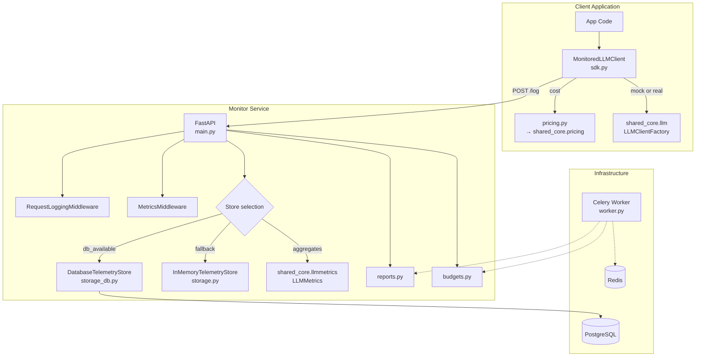
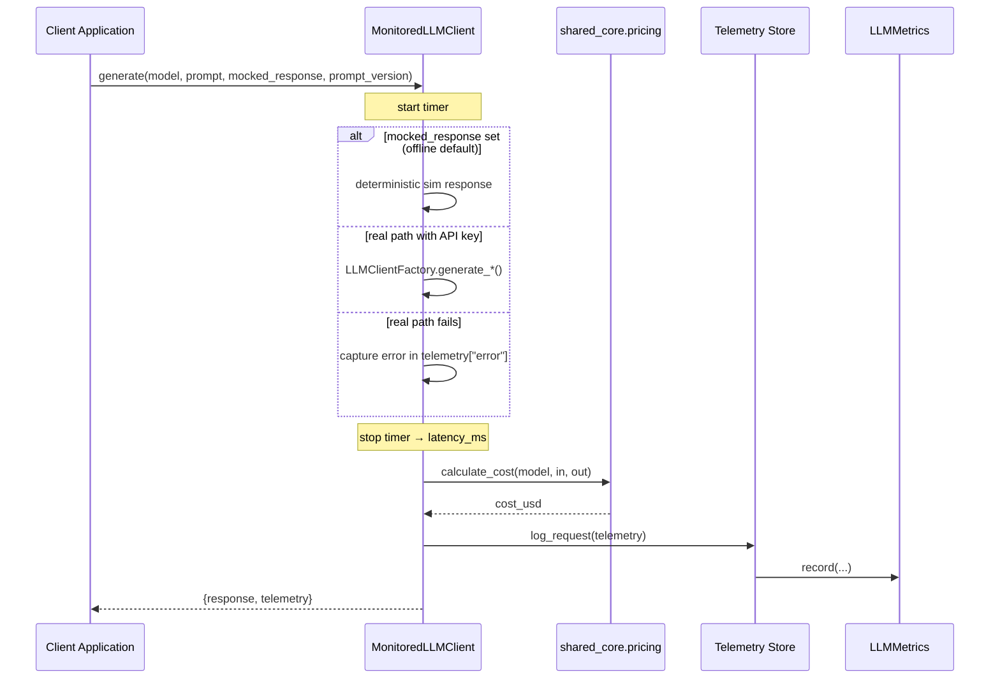
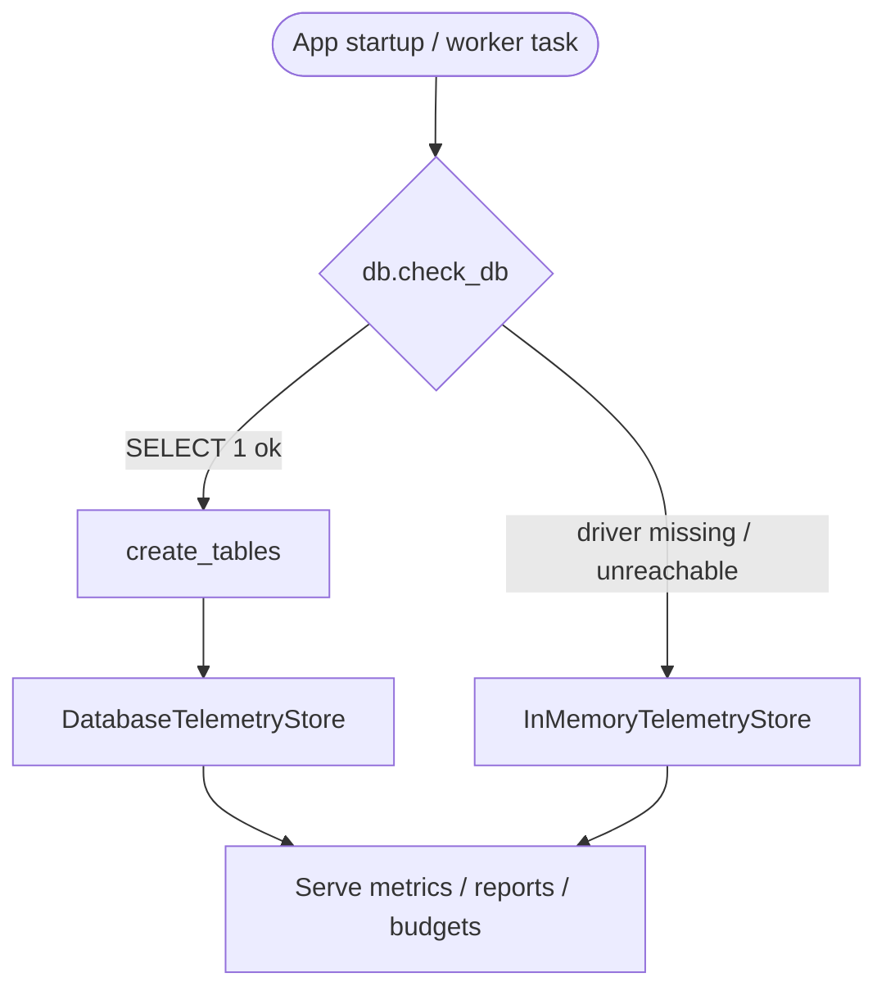

# Architecture — LLM Cost & Latency Monitor

This document details the design and dataflow of the LLM Cost & Latency Monitor.

---

## 1. System Overview

The system has two boundaries:

1. **Client-Side SDK Wrapper** (`sdk.py`) — embeds in application code to intercept LLM calls, measure latency, estimate cost (delegated to `shared_core.pricing`), and emit a telemetry record. It runs **mocked** by default and calls **real** OpenAI/Anthropic when API keys are configured.
2. **Server-Side API Service** (`main.py`) — ingests telemetry, persists it (PostgreSQL when available, in-memory otherwise), and serves aggregate metrics, Prometheus metrics, daily reports, and budget alerts. A Celery worker (`worker.py`) runs reporting/budget tasks asynchronously.

All aggregation (totals, per-model, per-prompt-version, p50/p95/p99 latency, error rate) is delegated to `shared_core.llmmetrics.LLMMetrics`, so both stores compute identical numbers.

---

## 2. Component Diagram

---

## 3. Dataflow & Execution Sequence

---

## 4. Store Selection & Persistence

On startup the app calls `db.check_db()`, which builds a `DatabaseManager` **lazily** (so importing the app never requires a Postgres driver) and probes `SELECT 1`:

Both stores expose the same interface (`log_request`, `get_aggregates`, `summary`, `logs`), so every consumer — the API, the dashboard, the report generator, the budget engine — works against either backend unchanged. The DB store loads persisted rows into a fresh `LLMMetrics` for aggregation, keeping percentile/error-rate math identical to the in-memory path.

---

## 5. Module Breakdown

| Module | Responsibility |
|--------|----------------|
| `sdk.py` | `MonitoredLLMClient` — mock/real generation, telemetry capture (latency, tokens, cost, prompt_version, error) |
| `pricing.py` | Thin wrapper delegating cost math to `shared_core.pricing`; derives a per-1k display `PRICING_MAP` |
| `storage.py` | `InMemoryTelemetryStore` backed by `LLMMetrics` (offline-first default) |
| `storage_db.py` | `DatabaseTelemetryStore` — SQLAlchemy persistence, same aggregation engine |
| `models.py` | `LLMCall` ORM model (model, tokens, cost, latency, prompt_version, error, timestamps) |
| `db.py` | `db_available` probe + lazy `DatabaseManager` + store selection |
| `reports.py` | Daily report rollups (JSON + CSV) per UTC day |
| `budgets.py` | USD budget evaluation → flagged alerts (total + per-model) |
| `main.py` | FastAPI app, middleware wiring, all endpoints, startup probe |
| `worker.py` | Celery app + `generate_daily_report` / `check_budget` tasks |
| `dashboard.py` | Text/HTML dashboard renderers (read from `get_aggregates`) |
| `config.py` | `AppConfig` extending `BaseAppConfig` (adds budget thresholds) |
