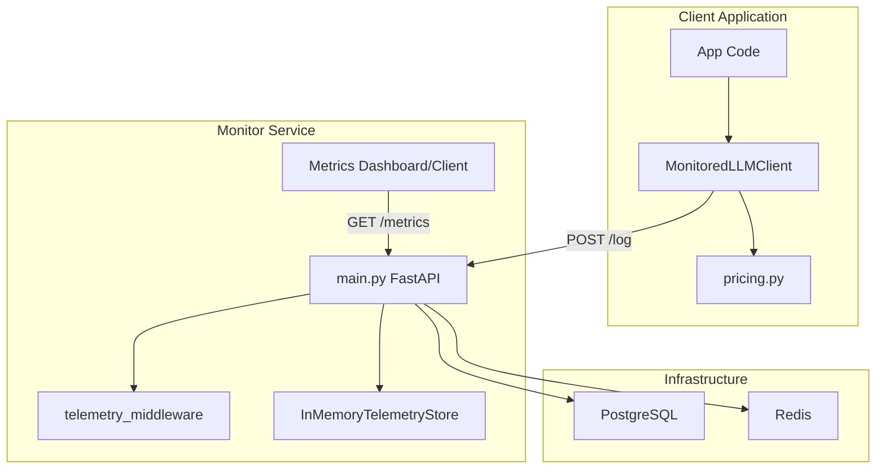
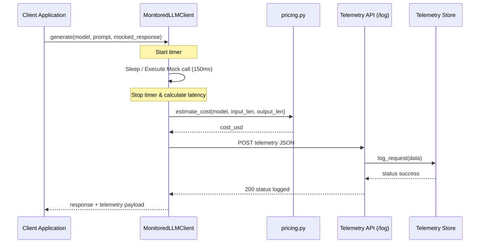

# Architectural Design - LLM Cost & Latency Monitor

This document details the architectural design and dataflow of the LLM Cost & Latency Monitor.

---

## 1. System Overview

The system consists of two primary boundaries:
1. **Client-Side SDK Wrapper**: Integrates into application code to intercept LLM API calls, compute token estimates, estimate execution costs, and track request latency.
2. **Server-Side API Service**: Receives logs from client SDKs, records request history, and serves aggregated operational metrics (total requests, total cost, average latency).

---

## 2. Component Diagram

---

## 3. Dataflow & Execution Sequence

---

## 4. Module Breakdown

### 4.1 Client SDK (`sdk.py` & `pricing.py`)
- **`MonitoredLLMClient`**: Wraps OpenAI/Anthropic SDK operations. Automatically captures invocation timestamps to measure elapsed time (`latency_ms`).
- **`PRICING_MAP`**: Statically defines token pricing rates per 1,000 input and output tokens for supported models (e.g., `gpt-4`, `gpt-3.5-turbo`, `claude-3-opus`).
- **`estimate_cost`**: Estimates dollar cost as `(input_tokens / 1000 * input_rate) + (output_tokens / 1000 * output_rate)`.

### 4.2 API Server (`main.py` & `middleware.py` & `storage.py`)
- **`FastAPI App`**: Hosts the web interface.
- **`telemetry_middleware`**: Logs all incoming HTTP request methods, paths, status codes, and execution speeds using standard `loguru` formatters.
- **`InMemoryTelemetryStore`**: Serves as a lightweight in-memory cache to save telemetry records. Calculates aggregated analytics dynamically via `get_aggregates()`.
