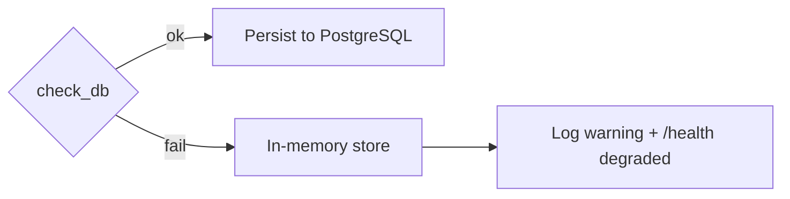

# Failure Modes & Mitigation — LLM Cost & Latency Monitor

Anticipated failure modes, detection, and mitigation.

---

## 1. Database unavailable at startup

- **Cause**: PostgreSQL is unreachable or its driver is not installed.
- **Impact**: **None to availability.** `db.check_db()` catches the failure, logs a warning, and the service falls back to `InMemoryTelemetryStore`. All endpoints keep working; telemetry simply is not persisted across restarts.
- **Detection**: `GET /health` reports `database: offline` / status `degraded`; startup log shows "Database unavailable — falling back to in-memory telemetry store".
- **Mitigation**: `make docker-up` (or fix `DATABASE_URL`) and restart; the next startup probe selects the DB store.

---

## 2. Unbounded in-memory growth (OOM)

- **Cause**: Sustained high-throughput logging while running on the in-memory store accumulates records in `self.logs` and the backing `LLMMetrics`.
- **Impact**: RAM grows until the worker is OOM-killed (502/504s).
- **Detection**: System memory alerts; `total_calls` climbing without bound on a long-lived in-memory instance.
- **Mitigation**: Run with the database backend (rows are durable, not all held for serving). Restart clears memory but drops unpersisted history.
- **Future fix**: Cap the in-memory list (rolling window) and/or push aggregation into SQL so serving does not require loading every row.

---

## 3. Unknown model pricing

- **Cause**: A model id not in `shared_core.pricing.MODEL_PRICING` (and not matched by prefix).
- **Impact**: Cost uses the **conservative default** (5.0/15.0 per 1M tokens) — not `$0.00` — so spend is over- rather than under-counted, and a one-time warning is logged.
- **Detection**: Log warning "No pricing for model '<x>'; using conservative default".
- **Mitigation**: `shared_core.pricing.register_pricing(...)` or a JSON/YAML override file via `load_pricing_override`.

---

## 4. Real LLM call failure (provider error / no key)

- **Cause**: Provider outage, rate limit, malformed request, or missing API key on the real path.
- **Impact**: The SDK does **not** raise to the caller. It records `telemetry["error"]`, sets `output_tokens=0`, and returns an empty response, so the call is counted in the **error rate** rather than crashing the app.
- **Detection**: `error_rate` rises on `/metrics`; `cost_by_prompt_version` and per-model breakdowns isolate the offending path; logs carry the exception string.
- **Mitigation**: Inspect the error string, verify keys/quotas; the budget and report endpoints continue to function.

---

## 5. Prometheus dependency missing

- **Cause**: `prometheus_client` not installed.
- **Impact**: `MetricsRegistry`/`metrics_endpoint` raise a clear `ImportError` with install guidance; it is declared as a project dependency so this only occurs in a broken environment.
- **Mitigation**: `pip install prometheus-client` (already in `requirements.txt` / `pyproject.toml`).

---

## 6. Celery broker (Redis) down

- **Cause**: Redis offline.
- **Impact**: The worker module still **imports** (broker is only contacted when a worker starts or a task is dispatched). Synchronous `/reports/daily` and `/budgets/alerts` are unaffected — only async scheduling is.
- **Detection**: Worker connection errors; `GET /health` reports `redis: offline`.
- **Mitigation**: `make docker-up`; until then use the synchronous HTTP endpoints.

---

## 7. Multi-replica in-memory divergence

- **Cause**: Running several stateless replicas on the in-memory store.
- **Impact**: Each replica sees only its own telemetry; `/metrics` is per-replica.
- **Mitigation**: Use the database backend so all replicas read/write shared, durable state.
